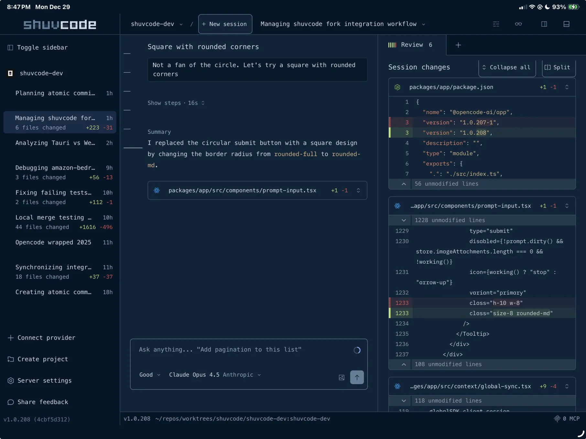
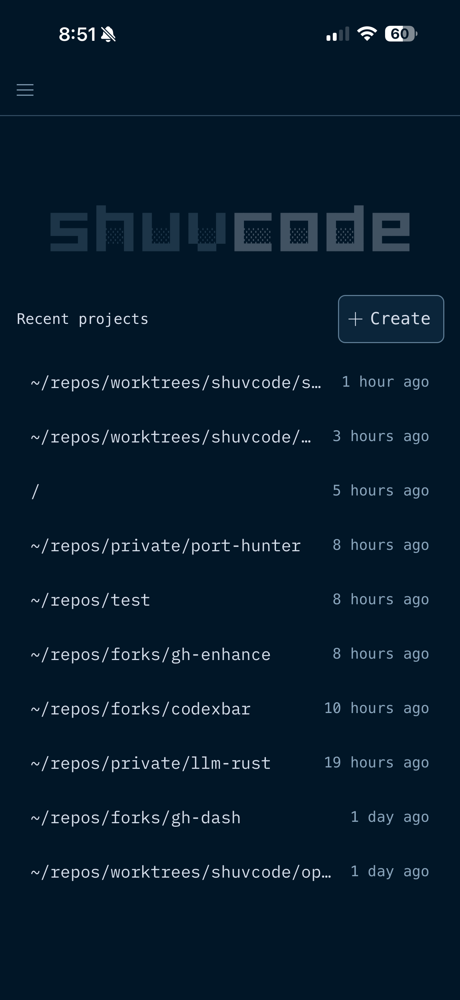
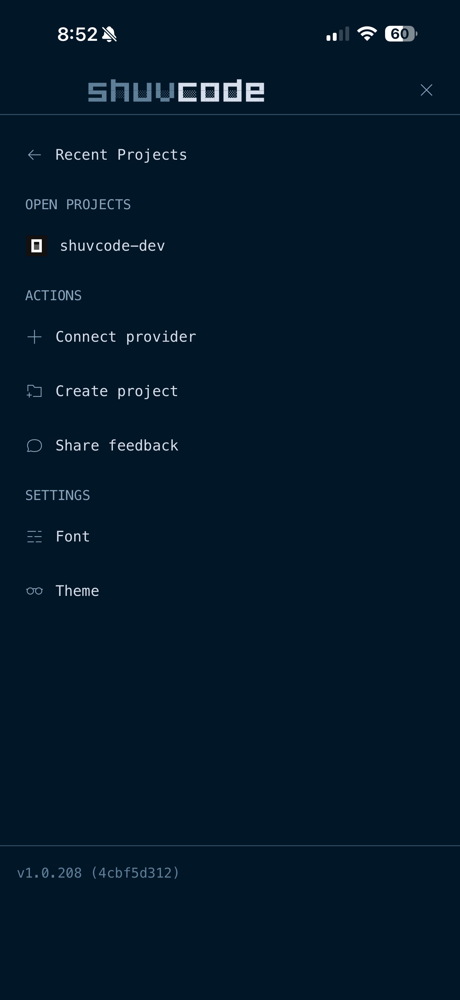
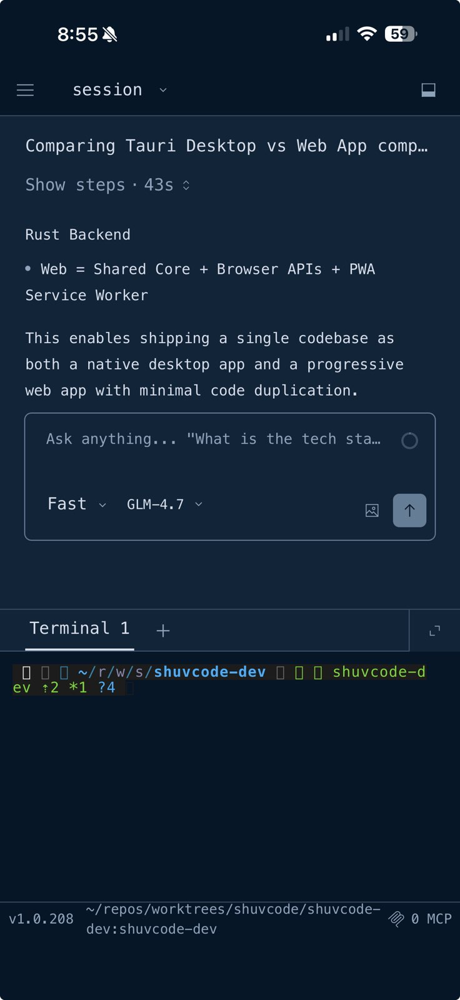
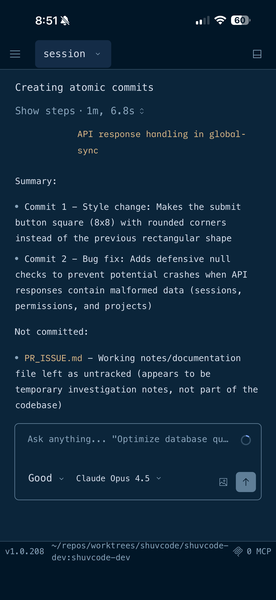
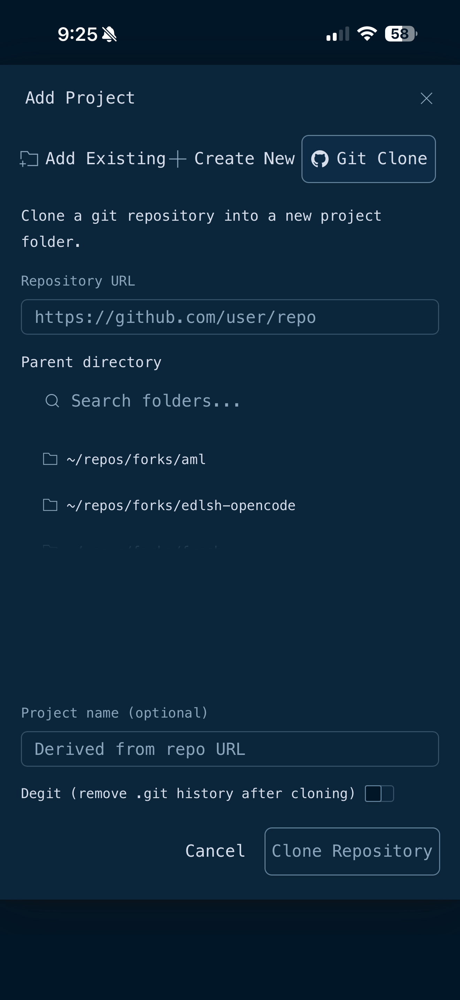
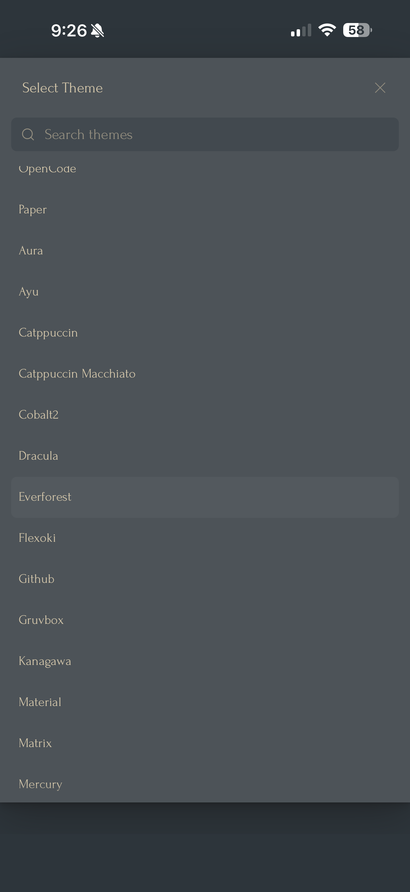

<h1 align="center">
</h1>
<p align="center">A fork of <a href="https://github.com/sst/opencode">opencode</a> - The AI coding agent built for the terminal.</p>
<p align="center">
  <a href="https://www.npmjs.com/package/shuvcode"></a>
  <a href="https://github.com/Latitudes-Dev/shuvcode/releases"></a>
</p>


---

## Screenshots

### Desktop App

<p align="center">
  
</p>

*Desktop session view with AI chat, session sidebar, and real-time code diff review*

### Mobile PWA

<p align="center">
  
  
  
</p>

<p align="center">
  
  
  
</p>

*Mobile PWA: Recent projects, sidebar menu, AI chat with terminal, commit summary, git clone dialog, and theme selector*

---

## Installation

```bash
# curl install
curl -fsSL https://shuv.ai/install | bash

# npm
npm i -g shuvcode@latest           # or bun/pnpm/yarn
```

---

## About

This fork serves as an integration testing ground for upstream PRs before they are merged into the main opencode repository. We merge, test, and validate promising features and fixes to help ensure quality contributions to the upstream project.

The desktop app is available from the [releases page](https://github.com/Latitudes-Dev/shuvcode/releases).

---

## Merged PRs (Pending Upstream)

The following PRs have been merged into this fork and are awaiting merge into upstream:

| PR                                                                            | Title                                       | Author                                                       | Status | Description                                                              |
| ----------------------------------------------------------------------------- | ------------------------------------------- | ------------------------------------------------------------ | ------ | ------------------------------------------------------------------------ |
| [#6476](https://github.com/sst/opencode/pull/6476)                            | Edit suggested changes before applying      | [@dmmulroy](https://github.com/dmmulroy)                     | Open   | Press 'e' to edit AI suggestions in your editor before accepting         |
| [#6507](https://github.com/sst/opencode/pull/6507)                            | Optimize Ripgrep.tree() (109x faster)       | [@Karavil](https://github.com/Karavil)                       | Open   | 109x performance improvement for large repos by streaming ripgrep output |
| [#6360](https://github.com/sst/opencode/pull/6360)                            | Desktop: Edit Project                       | [@dbpolito](https://github.com/dbpolito)                     | Merged | Edit project name, icon color, and custom icon image in desktop sidebar  |
| [#6368](https://github.com/sst/opencode/pull/6368)                            | Desktop: Sidebar subsessions support        | [@dbpolito](https://github.com/dbpolito)                     | Open   | Expand/collapse subsessions in sidebar with chevron indicators           |
| [#6372](https://github.com/sst/opencode/pull/6372)                            | Desktop: Image Preview and Dedupe           | [@dbpolito](https://github.com/dbpolito)                     | Merged | Click user attachments to preview images, dedupe file uploads            |
| [#4898](https://github.com/sst/opencode/pull/4898)                            | Search in messages                          | [@OpeOginni](https://github.com/OpeOginni)                   | Open   | Ctrl+ / to search through session messages with highlighting             |
| [#4791](https://github.com/sst/opencode/pull/4791)                            | Bash output with ANSI                       | [@remorses](https://github.com/remorses)                     | Open   | Full terminal emulation for bash output with color support               |
| [#4900](https://github.com/sst/opencode/pull/4900)                            | Double Ctrl+C to exit                       | [@AmineGuitouni](https://github.com/AmineGuitouni)           | Open   | Require double Ctrl+C within 2 seconds to prevent accidental exits       |
| [#4709](https://github.com/sst/opencode/pull/4709)                            | Live token usage during streaming           | [@arsham](https://github.com/arsham)                         | Open   | Real-time token tracking and display during model responses              |
| [#4865](https://github.com/sst/opencode/pull/4865)                            | Subagents sidebar with clickable navigation | [@franlol](https://github.com/franlol)                       | Open   | Show subagents in sidebar with click-to-navigate and parent keybind      |
| [#4515](https://github.com/sst/opencode/pull/4515)                            | Show plugins in /status                     | [@spoons-and-mirrors](https://github.com/spoons-and-mirrors) | Merged | Display configured plugins in /status dialog alongside MCP/LSP servers   |
| [#4411](https://github.com/sst/opencode/pull/4411)                            | Plugin Commands                             | [@spoons-and-mirrors](https://github.com/spoons-and-mirrors) | Open   | Register custom `/commands` from plugins with aliases and sessionOnly    |
| [#5958](https://github.com/sst/opencode/pull/5958)                            | AskQuestion Tool                            | [@iljod](https://github.com/iljod)                           | Open   | Interactive tool for AI to collect user input via TUI/web wizard dialogs |
| [#5508](https://github.com/sst/opencode/pull/5508)                            | Cache management command                    | [@JosXa](https://github.com/JosXa)                           | Open   | `opencode cache info` and `opencode cache clean` for plugin cache mgmt   |
| [#5873](https://github.com/sst/opencode/pull/5873)                            | IDE integration UX improvements             | [@tofunori](https://github.com/tofunori)                     | Open   | Selection in footer, synthetic context, home screen IDE status           |
| [#5917](https://github.com/sst/opencode/pull/5917)                            | Draggable sidebar resize                    | [@agustif](https://github.com/agustif)                       | Open   | Click and drag the sidebar border to resize, width persisted to KV store |
| [#5968](https://github.com/sst/opencode/pull/5968)                            | Better styling for small screens            | [@rekram1-node](https://github.com/rekram1-node)             | Reverted | Responsive TUI layout hiding elements on short/narrow terminals          |
| [#140](https://github.com/Latitudes-Dev/shuvcode/pull/140)                    | Toggle transparent background               | [@JosXa](https://github.com/JosXa)                           | Open   | Command palette toggle for transparent TUI background on any theme       |

_Last updated: 2026-01-04_

**Note:** Granular File Permissions (ariane-emory) was removed in v1.1.1 integration - upstream now provides similar functionality via PermissionNext.

---

## Feature Highlights

### Custom Server URL Settings

Configure a custom API server URL for the desktop app:

- **Settings dialog**: Access via command palette (Cmd/Ctrl+K → Settings)
- **URL validation**: Real-time validation with connection testing
- **Persistence**: Saved to localStorage, survives browser refresh
- **Error recovery**: Configure server URL directly from connection error pages

Useful for self-hosted deployments or development environments.

---

### GitHub App Integration

The fork includes a dedicated GitHub App (`shuvcode-agent`) for GitHub Actions automation:

- **Automatic PR reviews**: Trigger with `/shuvcode` or `/shuv` comments
- **Token exchange**: Secure OIDC-based authentication for CI workflows
- **Installation**: Run `shuvcode github install` to add the app to your repos

The API is deployed to `api.shuv.ai` with Cloudflare Durable Objects for session sync.

---

### Enhanced Create Project Dialog

The "Add Project" dialog now has three tabs:

- **Add Existing**: Browse and search folders from $HOME with fuzzy search
- **Create New**: Directory picker + project name field with path validation
- **Git Clone**: Clone from URL (coming soon)

Features git repo detection, existing project badges, and keyboard navigation.

---

### Desktop PWA Mobile Support

The desktop web app now fully supports mobile devices as a Progressive Web App (PWA):

- **Dynamic island handling**: Proper background color fills the notch/dynamic island area on newer iPhones
- **Mobile menu**: Full-screen navigation overlay accessible via hamburger button
- **Review overlay**: Access session changes and file viewer on mobile via the "Review" button in the header
- **Split/inline diff toggle**: Switch between side-by-side and inline diff views in the review panel
- **Responsive layout**: Timeline rail hidden on mobile, session pane takes full width

Install as PWA on iOS: Open in Safari → Share → Add to Home Screen

---

### IDE Integration (Cursor/VSCode)

Connect to Cursor, VSCode, or other supported IDEs for enhanced workflow:

- **Live text selection** from your editor is displayed in the TUI footer
- **Selection context** is automatically included in prompts (invisible to you, but sent to the model)
- **IDE status** shown on the home screen footer
- **Diff view** support for file edits (open diffs directly in your IDE)

Configure in `opencode.json`:

```jsonc
{
  "ide": {
    "lockfile_dir": "~/.cursor/opencode/",
    "auth_header_name": "x-opencode-auth",
  },
}
```

Supported IDEs: Cursor, VSCode, VSCode Insiders, VSCodium, Windsurf

---

### Add Existing Project Dialog

The desktop "Create project" button now opens an improved "Add Project" dialog with two tabs:

- **Add Existing**: Browse and search folders from your home directory with fuzzy search, see git repo indicators, and add existing projects with one click
- **Create New**: Original path input for creating new project directories

The folder browser scans up to 2 levels deep from `$HOME`, prioritizes git repositories, and shows which folders are already added as projects.

---

### Desktop Image Preview

The desktop file viewer now displays actual image previews for PNG, JPG, GIF, and WEBP files instead of showing raw base64 text. Images are centered and scaled to fit within the viewport with scrolling support for large images. SVG files are excluded from image preview and render as syntax-highlighted XML code.

---

### TUI Spinner Styles

Choose from 60+ animated spinner styles for tool execution indicators. Access via the command palette with `Change spinner style`. Your selection is persisted across sessions.

Available styles include braille patterns, block animations, geometric shapes, and creative concepts like moon phases, clock sweeps, and bouncing balls.

You can also adjust the animation speed via `Change spinner speed` in the command palette. Options range from 20ms (fastest) to 500ms (slowest), with 60ms as the default.

---

### TUI Layout Density

The TUI automatically adapts its vertical spacing for small terminals (< 28 rows). Configure via `tui.density`:

- `auto` (default): Switches to compact mode on small terminals
- `comfortable`: Standard spacing with footer and hints
- `compact`: Reduced padding, hides footer and secondary hints

Toggle density from the command palette or set in config:

```jsonc
{
  "tui": {
    "density": "auto",
  },
}
```

---

### AskQuestion Tool (Experimental)

Enable the AI to pause and ask structured questions via a wizard UI. Available in both TUI and web app.

Enable in `opencode.json`:

```jsonc
{
  "experimental": {
    "askquestion_tool": true,
  },
}
```

Features:
- Wizard-style multi-question dialogs with single/multi-select options
- Custom text input for freeform responses
- Keyboard navigation (1-8 quick select, Tab between questions, Enter to confirm)
- Works across TUI and web app with session resume support

---

### Agents

OpenCode includes two built-in agents you can switch between,
you can switch between these using the `Tab` key.

- **build** - Default, full access agent for development work
- **plan** - Read-only agent for analysis and code exploration
  - Denies file edits by default
  - Asks permission before running bash commands
  - Ideal for exploring unfamiliar codebases or planning changes

Also, included is a **general** subagent for complex searches and multistep tasks.
This is used internally and can be invoked using `@general` in messages.

Learn more about [agents](https://opencode.ai/docs/agents).

### Sessions Sidebar

A NERDTree-style sidebar for managing sessions. Toggle with `ctrl+n`.

| Key            | Action                       |
| -------------- | ---------------------------- |
| `j/k` or `↑/↓` | Move cursor                  |
| `Enter` or `o` | Open session / Toggle expand |
| `O`            | Expand all children          |
| `x`            | Collapse parent              |
| `X`            | Collapse all                 |
| `p`            | Go to parent                 |
| `g/G`          | Jump to top/bottom           |
| `n`            | New session                  |
| `r`            | Rename session               |
| `d`            | Delete session               |
| `?`            | Show help                    |
| `q` or `Esc`   | Close sidebar                |

### Documentation

For more info on how to configure OpenCode [**head over to our docs**](https://opencode.ai/docs).

### Contributing

If you're interested in contributing to OpenCode, please read our [contributing docs](./CONTRIBUTING.md) before submitting a pull request.

### Building on OpenCode

If you are working on a project that's related to OpenCode and is using "opencode" as a part of its name; for example, "opencode-dashboard" or "opencode-mobile", please add a note to your README to clarify that it is not built by the OpenCode team and is not affiliated with us in any way.

### FAQ

#### How is this different from Claude Code?

It's very similar to Claude Code in terms of capability. Here are the key differences:

- 100% open source
- Not coupled to any provider. Although we recommend the models we provide through [OpenCode Zen](https://opencode.ai/zen); OpenCode can be used with Claude, OpenAI, Google or even local models. As models evolve the gaps between them will close and pricing will drop so being provider-agnostic is important.
- Out of the box LSP support
- A focus on TUI. OpenCode is built by neovim users and the creators of [terminal.shop](https://terminal.shop); we are going to push the limits of what's possible in the terminal.
- A client/server architecture. This for example can allow OpenCode to run on your computer, while you can drive it remotely from a mobile app. Meaning that the TUI frontend is just one of the possible clients.

#### What's the other repo?

The other confusingly named repo has no relation to this one. You can [read the story behind it here](https://x.com/thdxr/status/1933561254481666466).

---

**Join our community** [Discord](https://discord.gg/opencode) | [X.com](https://x.com/opencode)
